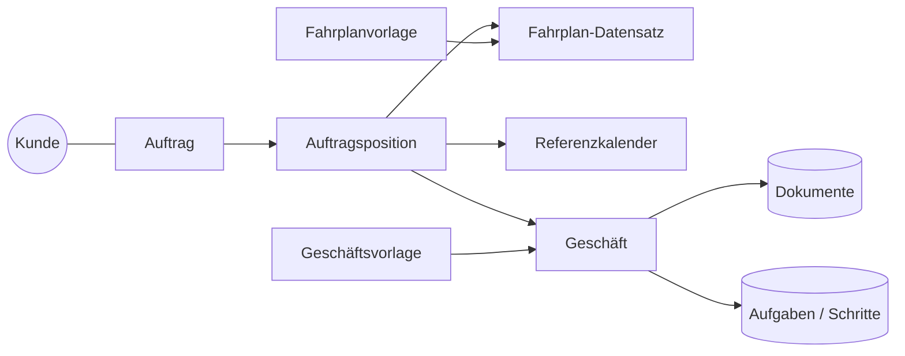
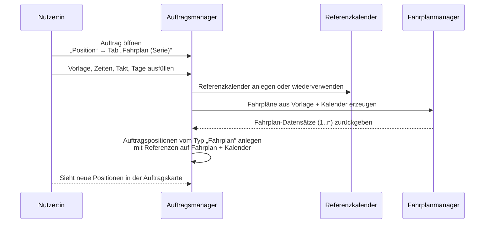
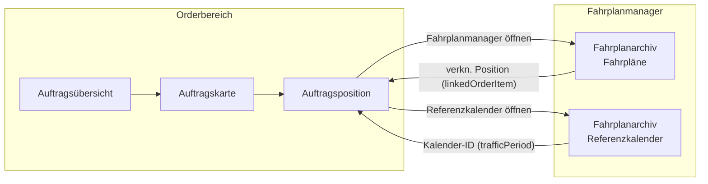
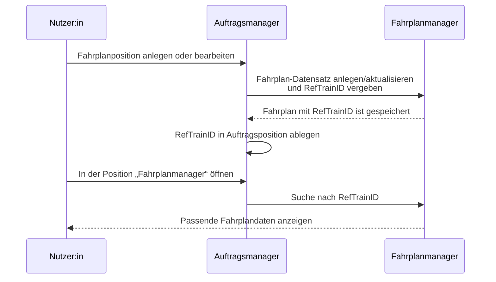

# Auftragsmanagement & Fahrplan-Mock  
## Begleitdokument für Fachanwender:innen und Kund:innen

Dieses Dokument begleitet den Angular-Mock für das Auftragsmanagement und den Fahrplanmanager.  
Es richtet sich bewusst an **nicht-technische Anwender:innen** (z. B. Disposition, Vertrieb, Fachprojektleitung) und soll drei Dinge leisten:

1. **Verstehen:** Welche Bereiche gibt es in der Anwendung, und was ist ihre Rolle im Gesamtprozess?  
2. **Bedienen:** Was passiert, wenn ich in der Oberfläche auf etwas klicke – und wie nutze ich die Funktionen richtig?  
3. **Bewerten:** Wo fühlt sich der Ablauf schlüssig an, wo fehlen Funktionen, und was sollte im späteren Produkt anders sein?

Der Mock ist eine **UI-Studie**: Er zeigt ein mögliches Zusammenspiel aus Aufträgen, Positionen, Geschäften, Fahrplänen und Referenzkalendern.  
Er ist bewusst ohne echtes Backend gebaut, damit Sie Abläufe ausprobieren und kommentieren können, ohne dass dahinter bereits reale Systeme angeschlossen sind.

> **Hinweis zu den fachlichen Grundlagen**  
> Dieses Begleitdokument baut auf zwei Quellen auf:  
> - dem SOB-Fachkonzept **„Fachkonzept Auftragsmanagement“** (`docs/Fachkonzept Auftragsmanagement 22587677-1.pdf`) und  
> - der technischen Produktspezifikation **„Auftragsmanagement – Produktspezifikation“** (`docs/order-management-spec.md`).  
> Die Kapitel 1–13 hier beschreiben die Oberfläche und Abläufe für Fachanwender:innen.  
> In Kapitel 14 und 15 wird der Bezug zu beiden Konzepten hergestellt, damit im Workshop klar ist, wo welche fachlichen und technischen Anforderungen verankert sind.

---

## 0. Für wen ist dieses Dokument?

Um das Lesen zu erleichtern, hier eine grobe Orientierung:

- **Disposition / operative Planung**
  - Besonders wichtige Kapitel:
    - 2. Startpunkt: Auftragsübersicht  
    - 3. Aufbau einer Auftragskarte  
    - 4. Auftragspositionen im Detail  
    - 5. Dialog „Auftragsposition hinzufügen“  
    - 8. Fahrplanarchiv & Referenzkalender  
  - Typische Fragen, die Sie damit beantworten:
    - „Wie finde ich schnell alle relevanten Positionen für heute / diese Woche?“  
    - „Wie lege ich eine neue Leistung oder Fahrplanserie an?“  
    - „Wie sehe ich, ob ein Fahrplan schon angefragt oder bestätigt ist?“

- **Vertrieb / Kundenbetreuung**
  - Besonders wichtige Kapitel:
    - 2. Startpunkt: Auftragsübersicht  
    - 3. Aufbau einer Auftragskarte (Kunde/Tags)  
    - 6. Geschäfte (Business)  
    - 7. Kunden – Kontext zu Aufträgen  
  - Typische Fragen:
    - „Welche Aufträge laufen aktuell für Kunde X?“  
    - „Welche Geschäfte sind in Arbeit / überfällig?“  
    - „Wo brauche ich Rückmeldung von Dispo / Fachbereich?“

- **Fachprojektleitung / Produktowner**
  - Besonders wichtige Kapitel:
    - 1. Überblick  
    - 2.–8. als Gesamtbild  
    - 6.4 Geschäftsvorlagen (Templates)  
    - 9.–11. (Insights, Fehlermeldungen, Validierung)  
  - Typische Fragen:
    - „Sind die Oberflächen für unsere Prozesse passend strukturiert?“  
    - „Welche Vorlagen und Automatismen ergeben fachlich Sinn?“  
    - „Wo sind Stolpersteine in der Bedienung?“

Sie können das Dokument gut **kapitelweise** lesen – es ist nicht zwingend nötig, alles in einem Rutsch durchzuarbeiten. Für einen ersten Eindruck empfiehlt sich Kapitel 2 („Aufträge“), und dann je nach Rolle die genannten Schwerpunkte.

---

## 1. Überblick: Welche Bereiche gibt es?

Die Anwendung gliedert sich grob in folgende Hauptbereiche:

- **Aufträge (Order Management):**  
  Hier sehen Sie alle Aufträge als Karten, inklusive Positionen (Leistungen und Fahrpläne), Statusinformationen, TTR-Phasen und Verknüpfungen zu Geschäften.

- **Auftragspositionen:**  
  Innerhalb eines Auftrags werden einzelne Positionen gepflegt – z. B. Werkstattleistungen, Sonderfahrten oder ganze Fahrplanserien.

- **Geschäfte (Business Management):**  
  Ein Geschäft bündelt Aktivitäten, Aufgaben und Dokumente, die zu mehreren Auftragspositionen gehören können (z. B. „TTR Abstimmung Fahrplanjahr 2026“).

- **Kunden (Customer Management):**  
  Hier verwalten Sie Kundenstammdaten, Projektnummern und Ansprechpartner. Aufträge können (optional) einem Kunden zugeordnet sein.

- **Vorlagen:**  
  Es gibt zwei Arten von Vorlagen:
  - Vorlagen für **Geschäfte** (z. B. Standard-Aufgabenpaket für eine TTR-Phase).
  - Vorlagen für **Fahrpläne** (z. B. ein wiederkehrender Zuglauf mit definierten Halten).

- **Fahrplanarchiv & Referenzkalender:**  
  Dieser Bereich zeigt alle erzeugten Fahrpläne und Kalender, die aus dem Auftragsmanagement heraus entstanden sind. Er dient als „Blick hinter die Kulissen“ des Timetable-Teils.

> **Hinweis für Screenshots:**  
> - Screenshot 1: Gesamtübersicht mit linkem Menü und Auftragsbereich hervorgehoben.  
> - Screenshot 2: Fahrplanarchiv mit markiertem Tab „Referenzkalender“.

Im Mock sind diese Bereiche über ein linkes Menü erreichbar (z. B. „Aufträge“, „Geschäfte“, „Kunden“, „Archiv“, „Vorlagen“).  
In diesem Dokument konzentrieren wir uns vor allem auf das Zusammenspiel von:

- Aufträgen
- Auftragspositionen
- Geschäften
- Fahrplanarchiv & Referenzkalendern

---

## 2. Startpunkt: Die Auftragsübersicht

### 2.1 Was sehe ich hier?

Wenn Sie im Menü den Punkt **„Aufträge“** wählen, landen Sie auf der **Auftragsübersicht**.  
Die Seite besteht – grob – aus drei Bereichen:

1. **Kopfbereich mit Kennzahlen**  
   Dort sehen Sie auf einen Blick:
   - Wie viele Aufträge es gibt.
   - Wie viele Positionen insgesamt existieren.
   - Wie viele Positionen „demnächst“ starten.
   - Wie viele Positionen eine Abweichung haben.
   - Wie viele TTR-Phasen aktuell belegt sind.

2. **Filterleiste und Insights**  
   Direkt darunter können Sie die angezeigten Aufträge einschränken – z. B. nach Tags, Status, Fahrplanjahr oder TTR-Phase.  
   Rechts daneben (oder darunter, je nach Bildschirmbreite) sehen Sie „Team-Insights“: z. B. die häufigsten Tags oder verantwortliche Personen.

3. **Auftragskarten**  
   Darunter folgt die eigentliche Liste der Aufträge.  
   Jeder Auftrag wird als Karte dargestellt, die sich aufklappen lässt und dann sämtliche Positionen zeigt.

> **Screenshot-Hinweis:**  
> - Screenshot 3: Auftragsübersicht mit markiertem Kopfbereich (Kennzahlen), Filterleiste und erster Auftragskarte.

### 2.2 Was passiert, wenn ich auf eine Kennzahl klicke?

Im Kopfbereich sehen Sie mehrere Kacheln mit Kennzahlen – zum Beispiel:

- „Aufträge“  
- „Positionen“  
- „Diese Woche“  
- „Auffälligkeiten“  
- „Phasen aktiv“  
- „Rolling Window“  
- „Short-Term“  
- „Ad-hoc“

**Wenn Sie eine dieser Kacheln anklicken**, passiert Folgendes:

- Die Anwendung setzt **passende Filter** im Hintergrund.  
  Beispiel:  
  - Klicken Sie auf „Diese Woche“, werden automatisch nur Positionen gezeigt, die in den nächsten sieben Tagen starten.  
  - Klicken Sie auf „Short-Term“, werden nur Positionen im Short-Term-Fenster (z. B. 30–7 Tage vor Fahrtag) hervorgehoben.

- Die Auftragskarten aktualisieren sich sofort.  
  - Karten, die keine passenden Positionen mehr enthalten, werden ggf. weniger relevant.  
  - Karten mit vielen Treffern werden automatisch aufgeklappt (damit Sie die betroffenen Positionen sofort sehen).

Diese Kacheln sind damit **Abkürzungen** für häufige Fragestellungen:  
„Was passiert diese Woche?“, „Wo ist kurzfristig etwas zu tun?“, „Wo haben wir viele Auffälligkeiten?“.

### 2.3 Suchfeld, Filter & gespeicherte Ansichten

Direkt unter den Kennzahlen befindet sich eine **Filterleiste**:

- Ein **Suchfeld**, das Name, ID, Tags und Verantwortliche durchsucht.  
  - Sie können frei tippen („Sonderzug“, „Basel“, „VIP“).  
  - Zusätzlich gibt es Kurzbefehle:
    - `tag:…` oder `#…` filtert nach Tags (z. B. `tag:rolling` oder `#rolling`).  
    - `resp:…` oder `@…` filtert nach verantwortlichen Personen.
- Eine Zeile **„Aktive Filter“**, die alle gesetzten Filter als Pille anzeigt:
  - Suche, Tag, TTR-Phase, Fahrplanfenster, Bezug (Fahrplantag / Fahrplanjahr / Produktionstag) usw.  
  - Jede Pille hat ein kleines „x“ – ein Klick entfernt den jeweiligen Filter.
- Eine Tag-Zeile, die **beliebte Tags** als klickbare Chips darstellt:
  - Zahl neben jedem Tag zeigt, wie viele Aufträge diesen Tag tragen.  
  - Ein erneuter Klick auf einen aktiven Tag entfernt den Filter wieder.
- Ein Bereich **„Gespeicherte Ansichten“**:
  - Wenn Sie eine interessante Filterkombination gefunden haben, können Sie sie speichern.  
  - Jede gespeicherte Ansicht erscheint als Chip („Preset“) und lässt sich anwenden, duplizieren, umbenennen oder löschen.
- Ein Button **„Vorlagen-Empfehlungen“**:
  - Öffnet rechts ein Panel mit Vorschlägen für Geschäftsvorlagen, die zu Ihrer aktuellen Filterlage passen (z. B. bestimmte TTR-Phase oder Tags).

Tipp: Wenn Sie sich „verlaufen haben“, können Sie über die Filterpillen oder den „Filter zurücksetzen“-Button in der Filterleiste wieder auf einen neutralen Stand zurückkehren.

### 2.4 Einen neuen Auftrag anlegen

Bevor Sie Positionen anlegen können, brauchen Sie einen Auftrag.  
Einen neuen Auftrag erstellen Sie über:

- den Button **„Auftrag anlegen“** im leeren Zustand der Auftragsübersicht oder  
- einen entsprechenden Eintrag im Menü (je nach Konfiguration).

Es öffnet sich der Dialog **„Neuer Auftrag“**.  
Die wichtigsten Felder:

- **Auftrags-ID** (optional)  
  - Dient zur eindeutigen Kennzeichnung, falls Ihr Haus bereits eigene Nummern vergibt (z. B. „A-2025-0003“).  
  - Lassen Sie das Feld leer, wenn das System später automatisch IDs vergeben soll.

- **Name** (Pflichtfeld)  
  - Kurzbeschreibung des Auftrags, die in der Übersicht und auf der Karte angezeigt wird (z. B. „EM 2028 Shuttleverkehr Rhein-Ruhr“).  
  - Sollte so gewählt sein, dass auch Dritte den Auftrag ohne weitere Erläuterung einordnen können.

- **Fahrplanjahr**  
  - Hier wählen Sie das Fahrplanjahr, in dem der Auftrag überwiegend läuft.  
  - Das System zeigt zur Orientierung den Zeitraum (Start- und Enddatum) des jeweiligen Fahrplanjahres an.  
  - Auftragspositionen sollten dieses Jahr im Regelfall nicht verlassen – so bleibt der Auftrag übersichtlich.

#### Kundenbereich im Neuanlage-Dialog

Der Abschnitt **„Kundenbereich“** dient dazu, den Auftrag einem Kunden zuzuordnen:

- **Kunde auswählen**  
  - Sie wählen aus einem gepflegten Kundenstamm (siehe Kapitel 7 „Kunden“).  
  - In der Liste sehen Sie Kundennummer und Name, z. B. „12345 · EVU Musterbahn AG“.
- **Kunde (frei)**  
  - Falls der Kunde noch nicht im Stammdatensystem angelegt ist oder Sie einen abweichenden Anzeigenamen benötigen, können Sie hier einen freien Text eintragen.  
  - Beispiel: „Stadtwerke Beispielstadt – Sonderverkehr Messe“.

Wenn Sie einen gepflegten Kunden auswählen, blendet die Anwendung eine **Kundenzusammenfassung** ein:

- Kundennummer, ggf. Projektnummer.  
- Adresse.  
- Liste der vorhandenen Kontaktpersonen (inkl. Rolle, E-Mail, Telefon).

So erkennen Sie bereits beim Anlegen, ob Sie den richtigen Kunden gewählt haben und welche Ansprechpartner es gibt.

#### Tags & Kommentar

Am Ende des Formulars können Sie zusätzliche Informationen hinterlegen:

- **Tags (kommagetrennt)**  
  - Schlagworte zur Gruppierung und Filterung, z. B. „S-Bahn, Q4“, „DE-Nord“, „Premium“.  
  - Diese Tags werden später in der Auftragskarte als Chips angezeigt und können als Filter genutzt werden.

- **Kommentar**  
  - Freitextfeld für interne Hinweise, z. B. „Pilotprojekt“, „wichtiger Referenzkunde“, „abhängig von Bauprojekt XY“.  
  - Der Kommentar erscheint am unteren Rand der Auftragskarte, wenn die Karte aufgeklappt ist.

#### Was passiert beim Speichern?

Wenn Sie auf **„Anlegen“** klicken:

1. Prüft die Anwendung, ob alle Pflichtfelder (Name, Fahrplanjahr) gefüllt sind.  
2. Legt sie einen neuen Auftrag an – dieser erscheint als zusätzliche Karte in der Auftragsübersicht.  
3. Zeigt die Karte standardmäßig eingeklappt; Sie können sie direkt aufklappen und mit dem Hinzufügen von Positionen beginnen.

Zuordnung und Datenflüsse:

- Wurde ein Kunde ausgewählt, erscheint sein Name im Kopf der Auftragskarte und der Auftrag wird im Kundenbereich unter „Verknüpfte Aufträge“ angezeigt.  
- Tags werden in den Team-Insights (beliebte Tags) und in der Filterleiste berücksichtigt.  
- Kommentare sind nur intern sichtbar und haben keine technische Wirkung – sie dienen der Kontextverständlichkeit.

#### Fragen für Ihr Feedback zur Auftragsübersicht

- Finden Sie die Anordnung von Kennzahlen, Filtern und Karten intuitiv?  
- Sind die Begriffe (z. B. „Short-Term“, „Rolling Window“) für alle Beteiligten verständlich?  
- Fehlen Ihnen Filtermöglichkeiten (z. B. nach Verantwortlichem, Kunde, Projekt)?  
- Ist der Dialog „Neuer Auftrag“ ausreichend erklärt und schlank genug – oder bräuchten Sie mehr/weniger Felder?

---

## 3. Aufbau einer Auftragskarte (Order Card)

Jeder Auftrag wird als Karte dargestellt.  
Die Karte ist in mehrere Bereiche gegliedert – wir gehen sie von oben nach unten durch.

### 3.1 Kopfbereich der Karte

Im oberen Teil sehen Sie:

- **Auftrags-ID** (kleine Kapsel mit Icon und Nummer).  
- **Auftragsname** (z. B. „ORD-TTR-DEMO“).  
- **Kundenname**, falls der Auftrag einem Kunden zugeordnet wurde.  
- **Fahrplanjahr**, in dem der Auftrag läuft.  
- **Tags** (Schlagworte), z. B. Region, Priorität oder Projektkürzel.

Wenn Sie auf den Kopfbereich klicken, wird die Karte **auf- oder zugeklappt**:

- **Zu**: Sie sehen nur den Kopf und einige Kennzahlen.  
- **Auf**: Sie sehen alle aktuell relevanten Auftragspositionen.

Tipp: Wenn Sie Filter setzen, klappen Karten mit Treffern automatisch auf.  
Entfernen Sie alle Filter, klappen Karten wieder zu, um Übersicht zu gewinnen.

> **Screenshot-Hinweis:**  
> - Screenshot 4: Einzelne Auftragskarte in aufgeklappter Ansicht, Kopfbereich und Gesundheitsanzeige hervorgehoben.

### 3.2 Gesundheitsanzeige des Auftrags

Rechts im Kopfbereich befindet sich eine **Gesundheitsanzeige**:

- Ein farbiger Badge mit einem Icon (z. B. Häkchen, Warnsymbol).  
- Eine Kurzbeschreibung wie „Planmäßig“, „Im Blick behalten“ oder „Kritisch“.  
- Kleine Zähler:
  - „Demnächst“ – wie viele Positionen bald starten.  
  - „Abweichungen“ – wie viele Positionen eine Abweichung oder Bemerkung haben.  
  - „Positionen“ – wie viele Positionen im aktuellen Filter überhaupt betrachtet werden.

Darunter sehen Sie einen **kleinen Balken** mit drei Farben:

- Teil, der bereits in der Vergangenheit liegt (Positionen, die schon gestartet sind).  
- Teil, der in naher Zukunft liegt.  
- Teil, der noch „offen“ ist (Positionen ohne Startzeit oder weit in der Zukunft).

Die Berechnung ist intern technisch, für Sie wichtig ist:

- Viele Abweichungen → eher orangener/roter Zustand.  
- Viele Positionen kurz vor Start → eher erhöhte Aufmerksamkeit.  
- Wenig Abweichung und keine kurzfristigen Starts → eher grüner Zustand.

Zusätzlich können Sie – fachlich gedacht – jeden Auftrag entlang eines **Auftrags-Prozessstatus** einordnen:

- **Auftrag** – es gibt eine Klammer mit Namen/Kostenträger, erste Positionen entstehen.  
- **Planung** – Trassen, Leistungen und Varianten werden ausgearbeitet (z. B. Jahresfahrplan, Extrazüge).  
- **Produkt/Leistung** – die geplanten Varianten sind entschieden, das „Produkt“ für die Produktion steht fachlich.  
- **Produktion** – Fahrpläne/Leistungen laufen im Betrieb.  
- **Abrechnung/Nachbereitung** – der Auftrag wird nachbearbeitet und abgerechnet.

Im Mock ist dieser Prozessstatus bereits als eigene Zeile direkt unter der Gesundheitsanzeige sichtbar:  
Neben einem kleinen Timeline‑Icon steht z. B. „Prozess: Planung“ oder „Prozess: Produktion“.  
Wenn Sie auf diese Zeile klicken, schalten Sie den Auftrag **eine Stufe weiter** im Prozess (Auftrag → Planung → Produkt/Leistung → Produktion → Abrechnung/Nachbereitung).

Wichtig für den Workshop:  
- Beim Schritt in die **Produktion** prüft die Anwendung, ob alle Fahrplan‑Positionen dieses Auftrags bereits den Fahrplanstatus **„Booked“** (TTT‑Status Contract) erreicht haben.  
- Gibt es noch Positionen, die nicht auf „Booked“ stehen, erscheint eine **Warnmeldung** mit einer kurzen Liste der betroffenen Positionen.  
- Sie können dann entscheiden, ob Sie den Auftrag **trotzdem** in die Produktion übergeben oder den Schritt **abbrechen** und zuerst die offenen Positionen klären.

Damit wird das im Fachkonzept beschriebene Verhalten („Warnung vor Übergabe in die Produktion, wenn nicht alle bestellten Pfade bestätigt sind“) im Mock anschaulich erlebbar gemacht.

### 3.3 Status-Bereiche innerhalb der Karte

Unter der Gesundheitsanzeige gibt es mehrere **Bereiche mit kleinen Chips**:

- **Geschäftsstatus** (z. B. „Neu“, „In Arbeit“, „Pausiert“, „Erledigt“).  
  - Diese Chips zählen, wie viele Positionen mit Geschäften in welchem Status verknüpft sind.  
  - Ein Klick auf einen Chip filtert die Auftragsliste nach diesem Status.

- **Fahrplanstatus** (Bedarf, Trassenanmeldung, Angebot, Vertrag, Betrieb, Archiv).  
  - Hier sehen Sie auf einen Blick, wie viele Positionen in welchem Fahrplanstatus sind.  
  - Ein Klick schränkt die Positionen in allen Aufträgen auf diesen Status ein.

- **TTR-Phasen** (Annual TT Request, Final Offer, Rolling Planning, Short-Term, Ad-hoc, Operative Begleitung).  
  - Jede Phase zeigt, wie viele Positionen ihr zugeordnet sind.  
  - Ein Klick filtert nach dieser TTR-Phase, ein weiterer Klick setzt den Filter wieder zurück.  
  - Fährt man mit der Maus über einen TTR-Chip, erschien ein Hinweistext, der Fenster & Bedeutung der Phase beschreibt (z. B. „Short-Term: 30–7 Tage vor Fahrplantag“).

- **Varianten & Fahrplanjahre**  
  - Varianten zeigen, ob Positionen verschiedene Kalender- oder Fahrplanvarianten nutzen (z. B. andere Tage, Baustellenfenster).  
  - Fahrplanjahre zeigen, wie viele Positionen welchem Fahrplanjahr zugeordnet sind, falls der Auftrag über mehrere Jahre verteilt ist.

Alle diese Chips sind **interaktiv**:  
Wenn Sie einen Chip anklicken, setzt oder verändert das die Filter im oberen Bereich.  
Die Anzahl der Positionen, die Sie sehen, passt sich sofort an.

Für Diskussionen im Workshop ist hilfreich, sich klarzumachen:

- Die **Fahrplanstatus-Chips** orientieren sich an den externen TTT-Prozessschritten (Bedarf, Path Request, Offer, Contract, Betrieb, Archiv).  
- Der **Auftrags-Prozessstatus** (siehe oben und Glossar) beschreibt dagegen die SOB-interne Sicht auf den Gesamtprozess eines Auftrags (Auftrag → Planung → Produkt/Leistung → Produktion → Abrechnung).  
- Beide Sichten ergänzen sich: Fahrplanstatus zeigen den Stand einzelner Fahrplanpositionen, der Auftrags-Prozessstatus fasst zusammen, wo der Auftrag als Ganzes steht.

### 3.4 Aktionen im Kopfbereich

Rechts oben in jeder Karte finden Sie Buttons, z. B.:

- **„Position“ (mit Plus-Icon)**  
  - Öffnet den Dialog **„Auftragsposition hinzufügen“**.  
  - Dort legen Sie neue Leistungen oder Fahrpläne an (siehe Kapitel 4).

- **„Geschäft verknüpfen“**  
  - Öffnet einen Dialog, in dem Sie mehrere Positionen dieses Auftrags mit einem bestehenden Geschäft verknüpfen können.  
  - Nach dem Speichern sehen Sie die Verknüpfung sowohl im Auftrag als auch in der Geschäftsübersicht.

- **„Status aktualisieren“**  
  - Öffnet einen Dialog, in dem Sie für mehrere Positionen gleichzeitig die **TTT‑Phase** (Fahrplanstatus, z. B. Bedarf → Trassenanmeldung) und optional einen **internen Bearbeitungsstatus** setzen können.  
  - Wenn Sie als internen Status **„Freigegeben“** oder **„Überarbeiten“** wählen, prüft die Anwendung, ob alle ausgewählten Positionen bereits mit mindestens einem **Geschäft** verknüpft sind.  
    - Ist das nicht der Fall, erscheint ein Hinweis („Positionen ohne verknüpftes Geschäft…“) und die Änderung wird nicht durchgeführt.  
    - So wird sichergestellt, dass freigegebene oder zurückzusendende Positionen immer einem Team bzw. einer Stelle zugeordnet sind – im Sinne der Geschäfts‑Vorlagen.

- **„Mehrfachauswahl“ (Checklisten-Icon)**  
  - Schaltet die Karten in einen Modus, in dem Sie Positionen einzeln markieren und anschließend gemeinsam „bestellen“ können.

Wenn Sie diese Aktionen nutzen, bekommen Sie im unteren Bereich des Bildschirms kurze Rückmeldungen (Snackbars), z. B. „3 Positionen bestellt“.

---

## 4. Auftragspositionen im Detail

### 4.1 Was ist eine Auftragsposition?

Eine Auftragsposition ist eine **konkrete Leistung** oder ein **konkreter Fahrplan**, der zum Auftrag gehört.  
Beispiele:

- Eine Werkstattleistung (z. B. „Radsatztausch in Basel“).  
- Ein Sonderzug mit bestimmten Fahrten.  
- Eine ganze Fahrplanserie, die jeden Tag zwischen zwei Orten verkehrt.

In der Karte sehen Sie die Positionen in einer Liste unterhalb des Kartenkopfs.

> **Screenshot-Hinweis:**  
> - Screenshot 5: Liste der Auftragspositionen innerhalb einer Karte, Typ, Zeitfenster und Route markiert.

### 4.2 Wie lese ich eine Position in der Liste?

Jede Position besteht aus mehreren Zeilen:

- **Name** der Position (z. B. „Werkstatt Basel Nachtpflege“).  
- **Typ** (Leistung oder Fahrplan).  
- **Zeitfenster** (Start–Ende, sofern vorhanden).  
- **Verantwortliche Person oder Stelle**.  
- **Fahrplanstatus** (Bedarf, Trassenanmeldung, Angebot, …).  
- **TTR-Phase**, in der die Position aktuell liegt.  
- **Gültigkeit** (z. B. „01.03.–31.10. gültig“).  
  - **Route** (von/bis, ggf. mit Servicetyp).  
  - **Tags** der Position (z. B. #rolling, #priority).

Zusätzlich – fachlich gedacht – kann jede Position einen **internen Bearbeitungsstatus** haben, der unabhängig vom Fahrplanstatus den Arbeitsstand beschreibt:

- „In Bearbeitung“ – jemand arbeitet aktiv an dieser Position.  
- „Freigegeben“ – fachlich geprüft, bereit für den nächsten Prozessschritt/Team.  
- „Überarbeiten“ – muss nochmals angepasst werden (es fehlen Informationen oder es soll zwischen Varianten entschieden werden).  
- „Beantragt“ – PathRequest ist gestellt; man wartet auf Angebot/Antwort.  
- „Abgeschlossen“ – die Position ist fachlich fertig.  
- „Annulliert“ – die Position wird nicht mehr benötigt (z. B. wegen Storno).

Im Mock werden diese internen Status bereits angezeigt:  
- In der Liste der Auftragspositionen sehen Sie unter der Gültigkeit eine Zeile **„Bearbeitungsstatus: …“**, sofern ein solcher Status gesetzt ist.  
- Im Kopf der Auftragskarte werden die internen Bearbeitungsstatus zusätzlich als kleine **Chips** aggregiert, z. B. „Freigegeben · 3“, „In Bearbeitung · 5“.  
So erkennen Sie sowohl pro Position als auch pro Auftrag auf einen Blick, wie viele Positionen in welchem internen Zustand sind.

> **Hinweis zur TTT-Konformität im Mock**  
> Die im Mock sichtbaren Fahrplanstatus (Draft / Path Request / Offered / Booked / Used / Cancelled) sind eine **vereinfachte Zusammenfassung** des TTT-Statusmodells.  \n> Einige spezielle TTT-Zustände wie „Refused“, „Not Available“ oder „Shadow“ werden im Mock nicht separat dargestellt, sondern gehen in den allgemeinen Phasen (z. B. Offer/Booked/Archiv) auf.  \n> Für den Workshop ist wichtig: fachliche Abläufe und Bedienung stehen im Vordergrund – die genaue technische Abbildung aller TTT-Status folgt in der späteren Integrationsphase.

 Zusätzlich können Sie diverse **verknüpfte Elemente** sehen:

 - Verknüpfter Fahrplanmanager-Eintrag (Button mit Zug-Icon).  
 - Verknüpfter Referenzkalender (Button mit Kalender-Icon).  
 - Verknüpfte Fahrplanvorlage (Button mit Schema-Icon).  
 - Verknüpfte Geschäfts-Karten (kleine Kärtchen mit Titel, Status, Frist und Ansprechpartner).  
 - **Versionschips** – z. B. „Version 2“ und darunter „Abgeleitet von Version 1“.  
   - Das bedeutet: Die Position wurde aus einer früheren Version abgeleitet (z. B. durch Aufteilen von Tagen oder Anpassen des Gültigkeitszeitraums).  
   - So sehen Sie auf einen Blick, welche Version die „aktuelle“ ist und woher sie stammt.  
 - **Original-Fahrplanblock** – zeigt den ursprünglichen Fahrplan:
   - ursprüngliche Zugnummer und Gültigkeitszeitraum.  
   - ursprüngliche Route.  
   - Varianten mit kurzen Erläuterungen (z. B. „werktags“, „nur Sa/So“).  
   - Modifikationen wie Baustellen oder Sonderfahrten (Datum + kurze Beschreibung).

### 4.3 Was passiert, wenn ich auf eine Position reagiere?

Sie haben pro Position typischerweise folgende Aktionen:

- **Bearbeiten (Stift-Icon)**  
  - Öffnet den Dialog zur Bearbeitung der Position.  
  - Dort können Sie Name, Zeiten, Route, Tags, ggf. und andere Angaben anpassen.

- **Bestellen (Papierflieger-Icon)**  
  - Markiert die Position als „bestellt“ im Sinne des Fahrplanstatus (z. B. Bedarf → Trassenanmeldung).  
  - In diesem Mock wird intern ein Statusfeld angepasst, später würde hier ein tatsächlicher Bestellvorgang Richtung Backend stattfinden.

  Fachlich gedacht würde sich dabei nicht nur der **Fahrplanstatus** ändern, sondern auch der **interne Bearbeitungsstatus** (z. B. von „In Bearbeitung“ zu „Beantragt“).  
  Im Mock erfolgt diese Umstellung des internen Status bewusst **nicht automatisch**, sondern über den Dialog **„Status aktualisieren“** im Kartenkopf: Dort können Sie für mehrere Positionen gleichzeitig TTT‑Phase und internen Bearbeitungsstatus setzen und so unterschiedliche Szenarien ausprobieren.

- **Mehrfachauswahl**  
  - Wenn der Mehrfachauswahlmodus aktiv ist, erscheint links eine Checkbox.  
  - Sie können mehrere Positionen markieren und anschließend gemeinsam bestellen.

 Wenn Sie eine Position anklicken oder aus der Geschäftsansicht heraus öffnen, scrollt die Anwendung automatisch zur passenden Zeile und hebt diese kurz hervor.  
 So behalten Sie den Kontext, auch wenn viele Positionen vorhanden sind.

 #### Fragen für Ihr Feedback zu Auftragspositionen

 - Können Sie aus der Positionsliste sofort erkennen, **was** die Position leistet (Leistung vs. Fahrplan) und **wann** sie wirkt?  
 - Sind die zusätzlichen Informationen (Tags, Varianten, Geschäfts-Karten, Originalfahrplan) hilfreich – oder wirkt die Darstellung überladen?  
 - Würden Sie bestimmte Informationen lieber erst nach einem Klick sehen (z. B. Originalfahrplan, Modifikationen)?  
 - Fehlt Ihnen eine Möglichkeit, Positionen anders zu sortieren oder zu gruppieren (z. B. nach Kunde, TTR-Phase, Verkehrstagen)?

---

## 5. Dialog „Auftragsposition hinzufügen“

Der Dialog öffnet sich, wenn Sie in einer Auftragskarte auf **„Position“** klicken.  
Er führt Sie Schritt für Schritt durch das Anlegen neuer Positionen.

### 5.1 Allgemeiner Aufbau

Der Dialog besteht aus:

- Einer **Titelleiste** („Auftragsposition hinzufügen“).  
- Einer **Tab-Leiste**, in der Sie wählen, wie Sie die Position anlegen möchten:
  1. Leistung  
  2. Fahrplan (Serie)  
  3. Fahrplan (Manuell)  
  4. Fahrplan (Import)
- Dem **Inhalt des gewählten Tabs** (Formulare und Hilfstexte).  
- Einer Sektion **„Geschäftsverknüpfung“**, in der Sie die neue Position ggf. mit einem Geschäft verbinden.  
- Den **Buttons „Abbrechen“ und „Speichern“**.

Im Folgenden gehen wir die wichtigsten Tabs aus fachlicher Sicht durch.

> **Screenshot-Hinweis:**  
> - Screenshot 6: Dialog „Auftragsposition hinzufügen“ mit sichtbarer Tab-Leiste und Business-Bereich.

### 5.2 Tab „Leistung“

Dieser Tab eignet sich, um **nicht-fahrplanbezogene Leistungen** anzulegen, z. B.:

- Werkstattleistungen  
- Reinigungen  
- Begleitdienste  
- sonstige Services rund um den Zug

Sie geben hier u. a. ein:

- Art der Leistung (z. B. „Werkstatt“, „Reinigung“).  
- Von-/Bis-Ort.  
- Start- und Endzeit (Uhrzeiten).  
- Gültigkeitstage über einen Referenzkalender (z. B. alle Freitage im März).  
- Optionale Bemerkung (z. B. „+3 Minuten Puffer“) und Tags.

**Was passiert beim Speichern?**

1. Für jeden ausgewählten Tag legt das System intern einen Eintrag im Referenzkalender an.  
2. Es erzeugt daraus eine Auftragsposition vom Typ „Leistung“.  
3. Auf Wunsch wird die Position mit einem Geschäft verknüpft (siehe unten).  
4. Die Auftragskarte aktualisiert sich, und die neuen Positionen erscheinen in der Liste.

### 5.3 Tab „Fahrplan (Serie)“

Hier legen Sie eine **ganze Serie von Fahrplänen** an, z. B.:

- „Zwischen 04:00 und 23:00 alle 30 Minuten von A nach B“  
- „Jeden Samstagabend ein Sonderzug für ein Event“

Sie wählen:

- Eine vorhandene Fahrplanvorlage (Strecke und Halte).  
- Start- und Endzeit der Serie.  
- Takt (z. B. alle 15 oder 30 Minuten).  
- Tage im Kalender, an denen die Serie gilt.  
- Optional ein Namenspräfix und Regeln für Zugnummern.

Der Dialog zeigt Ihnen in einer kleinen Vorschau:

- Wie viele Fahrten pro Tag entstehen.  
- Wie der Zeitraum aussieht (erste/letzte Abfahrt).  
- Beispielabfahrten.

**Was passiert beim Speichern?**

1. Die Anwendung berechnet alle konkreten Fahrten anhand der Vorlage und des Taktes.  
2. Es wird ein Referenzkalender verwendet oder neu angelegt, der die Einsatztage enthält.  
3. Für jede Fahrt entsteht intern ein Fahrplan-Datensatz (technisch: *TrainPlan*) und eine entsprechende Auftragsposition vom Typ „Fahrplan“.  
4. Jede Position verweist auf den zugrundeliegenden Fahrplan und den verwendeten Kalender.  
5. Wenn Sie im Dialog eine Geschäftsverknüpfung gewählt haben, werden alle neu entstandenen Positionen diesem Geschäft zugeordnet.

### 5.4 Tab „Fahrplan (Manuell)“

Dieser Tab eignet sich, wenn Sie **einen individuellen Fahrplan** anlegen möchten, der sich nicht direkt aus einer Vorlage ergibt:

- Sie stellen über einen eigenen Dialog „Fahrplan zusammenstellen“ Halte, Zeiten und ggf. Plattformen zusammen.  
- Anschließend legen Sie fest:
  - Zugnummer  
  - Verantwortliche Stelle  
  - Gültigkeitstage im Kalender  
  - optional Tags

**Was passiert beim Speichern?**

1. Die Anwendung legt im Referenzkalender eine passende Periode an (alle gewählten Tage, mit Tags).  
2. Sie erzeugt einen manuellen Fahrplan-Datensatz (technisch: *Manual-TrainPlan*) mit Ihren Halten und Zeiten.  
3. Auftragsposition und Fahrplan werden verknüpft.  
4. Bei Bedarf wird die Position einem Geschäft zugeordnet.

### 5.5 Tab „Fahrplan (Import)“

Hier können Sie **RailML-Dateien** oder andere Datenquellen importieren, um reale Fahrpläne in den Mock zu holen:

- Sie wählen eine Datei aus, die Zugläufe und Halte enthält.  
- Die Anwendung zeigt eine Liste der erkannten Züge, inklusive:
  - Name/Zugnummer  
  - Abfahrtszeiten  
  - Abweichungen zur erwarteten Vorlage (falls vorhanden)

Sie können:

- Züge filtern (z. B. nur solche mit bestimmten Abweichungen).  
- Mehrere Züge auswählen.  
- Einstellen, ob alle Züge in denselben Referenzkalender laufen oder je Gruppe ihren eigenen Kalender erhalten.

**Was passiert beim Speichern?**

1. Für die Züge wird, falls nötig, gruppenweise ein Referenzkalender angelegt (z. B. pro Serie).  
2. Für jeden ausgewählten Zug entsteht ein Fahrplan-Datensatz (technisch: *TrainPlan*) und eine Auftragsposition.  
3. Varianten (z. B. Sondertage) werden als Beziehungen zwischen den Positionen gekennzeichnet.  
4. Auf Wunsch werden die Positionen mit einem Geschäft verknüpft.

#### 5.5.1 Filter im Import-Tab

Damit Sie bei vielen importierten Zügen den Überblick behalten, gibt es eine eigene Filtersektion:

- **Allgemeine Suche**
  - Freitextsuche nach Train-ID oder Name.  
  - Optional können Start- und Zielort eingegrenzt werden (z. B. alle Züge Basel → Zürich).
- **Takt & Vorlagen**
  - Auswahl einer Taktvorlage: So sehen Sie z. B. nur Züge, die zu einer bestimmten Serie gehören.  
  - Checkbox „Nur Taktabweichungen“:
    - Blendet alle Züge aus, die exakt im Takt liegen.  
    - Es bleiben nur Züge übrig, deren Abfahrten nicht zu den erwarteten Zeitfenstern passen.
  - „Minimale Abweichung“:
    - Sie legen fest, ab wie vielen Minuten eine Abweichung interessant ist (z. B. nur Abweichungen größer als 5 Minuten).
  - Sortierung:
    - „Größte zuerst“ zeigt Züge mit den größten Abweichungen oben.  
    - „Keine“ zeigt die ursprüngliche Reihenfolge.

Ein Klick auf „Filter zurücksetzen“ stellt alle Filter auf den Ursprungszustand zurück.

### 5.6 Positionen nachträglich bearbeiten

Wenn Sie auf das Stift-Icon einer Position klicken, öffnet sich der Dialog **„Auftragsposition bearbeiten“**:

- Oben sehen Sie eine Zusammenfassung:
  - Ob die Position eine Leistung oder ein Fahrplan ist.  
  - Den aktuellen Fahrplanstatus.  
  - Das Fahrplanjahr und eine Kurzbeschreibung der Gültigkeit.
- Darunter erscheinen – je nach Typ – mehrere aufklappbare Bereiche:
  - **Allgemein** – Name, verantwortliche Stelle, Bemerkung, Tags.  
  - **Leistungsdetails** (nur für Leistungen) – Zeitfenster und von/bis-Orte, inkl. Auswahl eines bestehenden Referenzkalenders.  
  - **Gültigkeit** – Übersicht der Tage, an denen die Leistung gilt (für reine Gültigkeitspositionen).
  - **Verkehrstage & Varianten** (nur für Fahrpläne):
    - Ein Inline-Kalender zeigt, an welchen Tagen die Serie fährt.  
    - Sie können zwischen „Verkehrstage“ (Hauptkalender) und „Ausschlüsse“ wechseln.  
    - Änderungen werden direkt im hinterlegten Referenzkalender gespeichert.
  - **Fahrplanübersicht** (nur für Fahrpläne):
    - Zeigt Titel, Zugnummer, Verantwortliche und den Kalenderbereich des verknüpften Fahrplans.  
    - Über den Button „Fahrplan bearbeiten“ können Sie in einen Spezialdialog wechseln, um Halte und Zeiten anzupassen.

Wenn Sie speichern:

- Bleiben Verknüpfungen zu Fahrplänen und Kalendern erhalten.  
- Änderungen an Gültigkeitstagen wirken sich sofort auf die Auswertung (z. B. Fahrplanarchiv) aus.  
- Geschäftsverknüpfungen bleiben unverändert, es sei denn, Sie entfernen sie explizit in anderen Dialogen.

### 5.7 Mehrere Positionen gleichzeitig im Status ändern

Über den Button **„Status aktualisieren“** in einer Auftragskarte öffnen Sie einen Dialog, der zwei Schritte kombiniert:

1. **Zielphase wählen**
   - Sie sehen Kacheln für die möglichen Phasen (Bedarf, Trassenanmeldung, Angebot, Vertrag, Betrieb, Archiv).  
   - Jede Kachel zeigt ein Icon und die technische Bezeichnung.  
   - Ein Klick markiert die Phase als Ziel.
2. **Positionen auswählen**
   - Alle Positionen des Auftrags werden als Chips angezeigt.  
   - Per Klick wählen Sie, welche Positionen in die neue Phase wechseln sollen (z. B. alle mit Angebotsstatus).

Mit „Aktualisieren“ werden die ausgewählten Positionen gemeinsam in die neue Phase überführt.  
Sie können so z. B. nach einer TTR-Rückmeldung mehrere Positionen von „Angebot“ auf „Vertrag“ setzen, ohne jede Position einzeln bearbeiten zu müssen.

### 5.8 Fahrplan zusammenstellen und bearbeiten

In einigen Fällen reicht es nicht, nur Zeiten und Tage zu definieren – Sie wollen den **Fahrplan selbst** (Halte, Reihenfolge, Zeiten) genauer steuern. Dafür gibt es zwei spezielle Werkzeuge:

1. **„Fahrplan zusammenstellen“** (beim Tab „Fahrplan (Manuell)“).  
2. **„Fahrplan bearbeiten“** (im Bearbeitungsdialog einer bestehenden Fahrplanposition).

#### 5.8.1 Fahrplan zusammenstellen (Manueller Fahrplan)

Wenn Sie im Tab „Fahrplan (Manuell)“ auf „Fahrplan zusammenstellen“ klicken:

- Öffnet sich ein Dialog, in dem Sie Schritt für Schritt die Struktur des Zuges festlegen:
  - Sie starten mit einer kleinen Liste von Standardhalten (z. B. Ort 1, Ort 2, Ort 3).  
  - Sie können Halte hinzufügen, entfernen oder in der Reihenfolge verschieben.  
  - Für jeden Halt können Sie Ankunfts- und Abfahrtszeiten eintragen oder auch nur einen davon pflegen (z. B. reiner Ausstiegshalt).  
  - Bei Bedarf ergänzen Sie Informationen wie Bahnsteig, Land, Aktivitäten (z. B. Ein-/Ausstieg, Lokwechsel).
- Im Hintergrund prüft die Anwendung grob:
  - ob die Zeiten im Tagesverlauf plausibel sind,  
  - ob die Reihenfolge der Halte konsistent ist.

Wenn Sie den Dialog speichern:

- Wird die Stop-Liste als „Entwurf“ für den manuellen Fahrplan übernommen.  
- Sie landen wieder im Tab „Fahrplan (Manuell)“, wo Sie Zugnummer, Gültigkeitstage und Tags ergänzen.  
- Beim endgültigen Speichern (siehe Abschnitt 5.4) entsteht daraus der eigentliche Fahrplan-Datensatz (technisch: *TrainPlan*) plus Auftragsposition.

#### 5.8.2 Fahrplan bearbeiten (bestehende Position)

Wenn Sie eine bestehende Fahrplanposition bearbeiten und dort auf „Fahrplan bearbeiten“ klicken:

- Öffnet sich ein ähnlicher Dialog, diesmal auf Basis des **bestehenden Fahrplans**:
  - Alle aktuellen Halte sind bereits eingefüllt.  
  - Sie können Haltzeiten anpassen, Halte hinzufügen/entfernen oder neu anordnen.  
  - Optional können technische Details (z. B. Rolling-Stock-Segmente, Zusammenführen/Trennen) im Hintergrund berücksichtigt werden – im Mock wird dies nur angedeutet.
- Nach dem Speichern:
  - Wird ein **neuer Fahrplanstand** erzeugt (im Archiv sichtbar).  
  - Die Auftragsposition zeigt weiterhin denselben Bezug, aber mit aktualisierten Kalender- und Stopinformationen.  
  - Frühere Varianten/Versionen bleiben nachvollziehbar, sodass Sie erkennen, was sich geändert hat.

Für das Review ist vor allem wichtig:

- Wirkt die Bedienlogik „Halte hinzufügen/verschieben/ändern“ nachvollziehbar?  
- Reichen die Informationen im Dialog, um einen komplexeren Fahrplan zu überblicken?  
- Würden Sie bestimmte zusätzliche Prüfungen oder Hilfen erwarten (z. B. Mindestwendezeiten, Fahrzeit-Checks)?

---

## 6. Geschäfte (Business) – Aufgaben & Zusammenarbeit

Geschäfte sind **Arbeitsvorgänge**, die sich auf einen oder mehrere Aufträge bzw. Auftragspositionen beziehen.  
Beispiele:

- „TTR Abstimmung Fahrplanjahr 2027“  
- „Baumaßnahme Korridor Nord – Abstimmung mit EVU“  
- „Sonderverkehr EM-Spiel: Planung & Rückmeldung“

### 6.1 Geschäftsübersicht

In der Ansicht „Geschäfte“ sehen Sie:

- Eine Herozeile mit der Pipeline:
  - Wie viele Geschäfte insgesamt?  
  - Wie viele aktiv, abgeschlossen, überfällig oder bald fällig?
- Kennzahlenkarten, die auf Klick Filter setzen (z. B. nur aktive oder überfällige Geschäfte).
- Team-Insights:
  - Beliebte Tags (z. B. „DE-Nord“, „Premium-Kunde“).  
  - Zuständigkeiten, die viele Geschäfte betreuen.  
  - Statusverteilung (Neu, In Arbeit, Pausiert, Erledigt).  
  - Geschäfte mit kurzfristigen Fälligkeiten.

> **Screenshot-Hinweis:**  
> - Screenshot 7: Geschäftsübersicht mit Pipeline-Kennzahlen, einer Geschäfts-Karte und offenem Detail-Pane.

Filterleiste und gespeicherte Ansichten helfen, sich auf einen bestimmten Ausschnitt zu konzentrieren (z. B. „nur meine Geschäfte diese Woche“).

### 6.2 Geschäfts-Karten und Details

Jedes Geschäft wird als Karte angezeigt, mit:

- Titel und ID.  
- Status-Badge.  
- kleinen „Highlight-Pills“ (z. B. „Überfällig“, „Team A“, „Viele Positionen“).  
- Tags (frei vergeben).

Innerhalb einer Karte finden Sie mehrere Tabs:

1. **Details** – Beschreibung, Status-Auswahl, kleine Kennzahlen (z. B. Anzahl verknüpfter Positionen).  
2. **Positionen** – alle verknüpften Auftragspositionen, inklusive Auftragsname, Service, Zeitraum; mit Buttons „Öffnen“ oder „Verknüpfung lösen“.  
3. **Dokumente** – hinterlegte Dateien/Links (im Mock nur als Beispiel).

Rechts öffnet sich bei Auswahl ein **Detail-Pane**, das zusätzlich zeigt:

- Fälligkeitsfortschritt (z. B. wie viel Zeit bis zur Frist verbleibt).  
- Verantwortliche Person/Gruppe.  
- Tags, die Sie direkt im Pane ändern können.  
- Aktivitäten (z. B. Statuswechsel, neu verknüpfte Positionen).  
- Liste der verknüpften Positionen mit Direktlinks.

### 6.3 Wie verknüpfe ich Positionen mit Geschäften?

Es gibt mehrere Wege:

1. **Aus der Auftragskarte heraus**  
   - Klicken Sie auf **„Geschäft verknüpfen“**.  
   - Wählen Sie ein Geschäft und eine oder mehrere Positionen des Auftrags aus.  
   - Speichern Sie – die Verknüpfung ist nun sowohl im Auftrag als auch im Geschäft sichtbar.

2. **Beim Anlegen einer Position**  
   - Im Dialog „Auftragsposition hinzufügen“ gibt es die Sektion „Geschäftsverknüpfung“.  
   - Dort wählen Sie:
     - „Ohne Geschäft“  
     - „Bestehendes Geschäft nutzen“  
     - „Geschäft aus Vorlage erstellen“
   - Im letzten Fall wird eine definierte Geschäfts-Vorlage verwendet, um automatisch ein neues Geschäft zu erstellen (inkl. Frist, Zuständigkeit, Tags) und mit den neuen Positionen zu verbinden.

3. **Aus der Geschäftsübersicht**  
   - Öffnen Sie in der Geschäfts-Card den Tab „Positionen“.  
   - Klicken Sie auf „Positionen zuordnen“.  
   - Wählen Sie in einem Dialog passende Positionen aus (z. B. nach Auftrag, Tag, Zeitraum).

So können Sie beliebige Kombinationen aus Auftragspositionen und Geschäften modellieren – z. B. mehrere Aufträge, die alle in ein TTR-Abstimmungs-Geschäft laufen.

#### 6.3.1 Dialog „Geschäft verknüpfen“ im Detail

Wenn Sie in einer Auftragskarte auf **„Geschäft verknüpfen“** klicken, öffnet sich ein Dialog mit zwei Spalten:

- Links: eine Liste aller verfügbaren Geschäfte.  
- Rechts: eine Liste der Positionen innerhalb dieses Auftrags.

Die wichtigsten Elemente:

- **Suchfeld oben links**  
  - Sie können nach Titel, Geschäfts-ID oder Zuständigkeit suchen.  
  - Beispiel: „TTR“, „Korridor Nord“, „Team Planung Süd“.
- **Geschäftskarten**  
  - Jede Zeile zeigt Titel, ID, zuständige Person/Gruppe und den aktuellen Status (Neu, In Arbeit, Pausiert, Erledigt).  
  - Ein Klick auf eine Karte markiert dieses Geschäft als Ziel (es wird optisch hervorgehoben).
- **Positionsliste rechts**  
  - Zeigt alle Positionen des Auftrags, die prinzipiell verknüpft werden können.  
  - Standardmäßig werden Positionen, die **noch kein Geschäft** haben, vorausgewählt.  
  - Ein Klick auf eine Position toggelt die Auswahl (an/aus).

Wenn Sie auf „Verknüpfen“ klicken:

- Werden alle gewählten Positionen mit dem ausgewählten Geschäft verbunden.  
- Im Auftrag erscheinen entsprechende Geschäftskarten an jeder Position.  
- In der Geschäftsübersicht steigt die Anzahl verknüpfter Positionen; im Detail-Pane des Geschäfts sehen Sie die neuen Einträge.

Sie können denselben Dialog jederzeit erneut aufrufen, um:

- weitere Positionen zum Geschäft hinzuzunehmen oder  
- bestimmte Positionen zu entkoppeln (über die Geschäftsseite).

### 6.4 Geschäftsvorlagen (Templates)

Geschäftsvorlagen sind **wiederverwendbare Muster** für typische Vorgänge – zum Beispiel:

- „TTR Abstimmung Rolling Planning“  
- „Baumaßnahme: Stakeholder-Briefing & Rückmeldung“  
- „Sonderverkehr Event: Vorbereitung, Durchführung, Nachbereitung“

Sie legen fest:

- Welche **Aufgaben** zu einem Geschäft gehören (z. B. „Entwurf erstellen“, „mit EVU abstimmen“, „Freigabe dokumentieren“).  
- Welche **Rolle oder Person** typischerweise verantwortlich ist.  
- Welche **Fälligkeit** sinnvoll ist (z. B. 14 Tage vor Fahrplanwechsel).  
- Mit welchen **Tags** das Geschäft versehen werden soll (z. B. Region, Projekt, TTR-Phase).

#### 6.4.1 Wo sehe ich Geschäftsvorlagen?

Im Mock tauchen Geschäftsvorlagen an verschiedenen Stellen auf:

- In der **Geschäftsübersicht** als eigener Bereich „Vorlagen“ (bzw. Link zur Vorlagenverwaltung).  
  - Dort können Sie Vorlagen ansehen, bearbeiten oder entfernen.  
  - Jede Vorlage hat Titel, Beschreibung, Kategorie und empfohlene Zuständigkeit.
- Im **Empfehlungs-Panel** der Aufträge („Vorlagen-Empfehlungen“):  
  - Hier werden Vorlagen vorgeschlagen, deren Tags zur aktuellen Filterlage passen (z. B. bestimmte TTR-Phase oder Hashtags in der Suche).  
  - Ein Klick führt zur Vorlagenansicht, in der Sie Details sehen und entscheiden können, ob Sie diese Vorlage übernehmen möchten.
- Im Dialog **„Auftragsposition hinzufügen“** unter „Geschäftsverknüpfung“:
  - Wenn Sie „Vorlage“ als Modus wählen, sehen Sie eine Liste der verfügbaren Geschäftsvorlagen.  
  - Sie wählen eine Vorlage aus, können Titel und Zieldatum anpassen und optional einen kurzen Hinweis hinterlegen.

#### 6.4.2 Was passiert, wenn ich eine Geschäftsvorlage verwende?

Wenn Sie beim Anlegen einer Position **„Vorlage“** auswählen und eine Geschäftsvorlage anklicken:

1. Es wird ein **neues Geschäft** erstellt, das auf dieser Vorlage basiert:
   - Titel: Entweder der Standardtitel der Vorlage oder Ihr individueller Titel.  
   - Beschreibung und Hinweise: werden aus der Vorlage übernommen und ggf. mit Ihrem eigenen Hinweis ergänzt.  
   - Fälligkeitsdatum: wird aus einer hinterlegten Regel abgeleitet (z. B. „7 Tage nach heute“ oder „30 Tage vor Fahrplanwechsel“).  
   - Zuständigkeit: wird gemäß der Empfehlung der Vorlage gesetzt (z. B. Team oder Person).
2. Die gerade angelegten **Auftragsposition(en)** werden mit diesem neuen Geschäft verknüpft:
   - Das Geschäft erscheint direkt in der Geschäftsübersicht.  
   - In der Auftragskarte sehen Sie eine Geschäftskarte an jeder verknüpften Position.
3. Das neue Geschäft erhält **Tags** aus der Vorlage:
   - So erscheint es in den Team-Insights (z. B. unter „Beliebte Tags“).  
   - Sie können später in der Geschäftsübersicht nach diesen Tags filtern.

So sparen Sie sich doppelte Erfassungsarbeit und stellen gleichzeitig sicher, dass ähnliche Vorgänge auch ähnlich strukturiert sind.

#### 6.4.3 Vorlagen und Automatisierung

Ein Teil der Geschäftsvorlagen kann mit **Automatisierungsregeln** verknüpft sein – insbesondere im Kontext der TTR-Phasen:

- Beispiel: Eine Vorlage „Rolling Planning – Abstimmung“ könnte so konfiguriert sein, dass sie automatisch aktiviert wird, wenn:
  - eine Auftragsposition in die TTR-Phase „Rolling Planning“ fällt,  
  - bestimmte Tags trägt (z. B. #premium oder eine bestimmte Region).

Im Mock wird das Verhalten schematisch angedeutet:

- In der Business-Sektion des Dialogs „Auftragsposition hinzufügen“ können Sie Automationen **aktivieren/deaktivieren**.  
- Sie sehen eine Liste möglicher Regeln („Welche Automationen sollen beim Erstellen ausgelöst werden?“).  
- Im Hintergrund könnten solche Regeln z. B. dafür sorgen, dass:
  - ein neues Geschäft erstellt oder  
  - eine bestehende TTR-Abstimmung automatisch um weitere Positionen ergänzt wird.

Ziel ist, dass standardisierte Vorgänge (TTR, Baustellen, Sonderverkehre) möglichst **wenig manuelle Schritte** erfordern, sobald die Regeln einmal definiert wurden.

#### 6.4.4 Wie sollte ich Vorlagen im Review betrachten?

Bei der Bewertung des Mocks können Ihnen folgende Fragen helfen:

- Sind die vorgeschlagenen Vorlagen sinnvoll benannt (verstehen alle sofort, worum es geht)?  
- Reichen Titel, Beschreibung und Fälligkeit aus, um einen Vorgang fachlich korrekt zu steuern?  
- Fehlen aus Ihrer Sicht wichtige Felder (z. B. Priorität, Region, Kategorie)?  
- Welche TTR- oder Prozessphasen in Ihrem Alltag würden sich besonders für Vorlagen eignen?  
- Wo wäre eine automatische Erstellung/Erweiterung von Geschäften hilfreich – und wo möchten Sie lieber manuell entscheiden?

Ihre Antworten sind wichtig, um später festzulegen:

- welche Geschäftsvorlagen fest in das Produkt aufgenommen werden,  
- wie detailliert sie werden sollen (z. B. Checklisten vs. nur Titel/Fälligkeit),  
- und ob Automatismen im Standardumfang enthalten sein sollen.

#### Fragen für Ihr Feedback zu Geschäften & Vorlagen

- Bilden die Geschäfts-Karten und das Detail-Pane Ihre tägliche Arbeit gut ab (Status, Fälligkeit, Zuständigkeit, verknüpfte Positionen)?  
- Sind die vorgeschlagenen Geschäftsvorlagen (Titel, Beschreibung, Fälligkeit) für Ihre Szenarien sinnvoll?  
- Möchten Sie eher **wenige, generische** Vorlagen oder **viele, sehr spezielle**?  
- An welchen Stellen würden Sie sich mehr Automatisierung wünschen – und wo möchten Sie bewusst selbst entscheiden?

---

## 7. Kunden – Kontext zu Aufträgen

Der Bereich „Kunden“ dient als einfache CRM-Übersicht:

- Sie erfassen Kunden mit Kundennummer, optional Projektnummer, Adresse und Notizen.  
- Sie führen Kontaktpersonen mit Rolle, E-Mail und Telefon.

In der Kundenliste sehen Sie außerdem:

- Welche Aufträge für einen Kunden angelegt wurden (Chips mit Auftrags-ID und Name).  
- Wie viele Kontakte für den Kunden hinterlegt sind.

Wenn Sie im Order-Dialog einen Kunden zuordnen:

- Erscheint der Kundenname auf der Auftragskarte.  
- Die Kunden-Kennzahlen (z. B. verknüpfte Aufträge) aktualisieren sich automatisch.

Beim Löschen eines Kunden:

- Fordert der Mock eine Bestätigung an.  
- Entfernt die Zuordnung in den Aufträgen, lässt aber die Aufträge selbst bestehen.  
- So bleibt der historische Kontext für Tests erhalten, ohne dass etwas „verschwindet“.

> **Screenshot-Hinweis:**  
> - Screenshot 8: Kundenübersicht mit geöffnetem Kundenformular (Neuanlage) und einer Kundenkarte mit verknüpften Aufträgen.

#### Fragen für Ihr Feedback zu Kunden

- Reicht der Umfang der Kundenstammdaten (Name, Nummer, Projekt, Adresse, Notizen, Kontakte) für Ihre Praxis aus?  
- Fehlt Ihnen eine Unterscheidung (z. B. Kunde vs. Mandant vs. Projekt)?  
- Wie wichtig ist die Anzeige „Verknüpfte Aufträge“ im Kundenbereich für Ihre tägliche Arbeit?  
- Würden Sie bestimmte Kundeninformationen auch direkt auf den Auftragskarten sehen wollen (z. B. Kundentyp, Projektstatus)?

---

## 8. Fahrplanarchiv & Referenzkalender

Der Bereich „Fahrplanarchiv“ beantwortet die Frage:  
**„Welche Fahrpläne und Kalender sind durch meine Arbeit im Auftragsmanagement entstanden?“**

### 8.0 Wie kommen Fahrpläne in den Fahrplanmanager – und was ist die RefTrainID?

Bevor wir die Archiv-Ansicht anschauen, hilft ein kurzer Blick auf den Datenfluss:

- Immer wenn Sie im Auftragsmanager einen **Fahrplan anlegen oder ändern** (Serie, manuell, Import, Modifikation), wird im Hintergrund ein Fahrplan-Datensatz erzeugt oder aktualisiert.  
- Jeder Fahrplan-Datensatz erhält eine **eindeutige interne Kennung**, die im Mock als *RefTrainID* (Referenz-Zug-ID) geführt wird.

Diese RefTrainID wird an zwei Stellen verwendet:

1. **Im Fahrplanmanager / Archiv**  
   - Dort ist die RefTrainID der Schlüssel, über den der Fahrplan gefunden und weiterbearbeitet werden kann.  
   - Wenn Sie von einer Auftragsposition aus auf „Fahrplanmanager“ klicken, übergibt die Anwendung genau diese ID an den Fahrplanmanager (als Suchkriterium).
2. **Im Auftragsmanagement**  
   - Die RefTrainID wird bei jeder Fahrplanposition gespeichert. Dadurch kann der Auftragsbereich:
     - den aktuellen Fahrplanstatus (z. B. Bedarf, Angefragt, Bestätigt) anhand der hinterlegten Fahrplandaten ermitteln und in den Status-Chips anzeigen,  
     - in der Positionszeile einen kompakten Überblick zum Fahrplan geben (Original-Fahrplanblock mit Strecke, Gültigkeit und – soweit im Datenbestand vorhanden – Varianten und Modifikationen).  
   - Im Mock ist diese Kopplung vereinfacht umgesetzt und soll vor allem zeigen, dass Position, Fahrplan und Kalender über eine gemeinsame ID zusammengehören.

Vereinfacht gesagt:

- Der Fahrplanmanager „gehört“ die Wahrheit über den Fahrplan (Halte, Zeiten, Fahrplanstatus),  
- der Auftragsmanager zeigt diese Wahrheit an der passenden Stelle (in der Position) an – und nutzt die RefTrainID, um beides eindeutig zu verbinden.

#### Schritt-für-Schritt: Vom Auftrag zum Fahrplanmanager

Wenn man den Weg einer Fahrplanposition einmal durchspielt, passiert grob Folgendes:

1. Sie legen im Auftrag eine Fahrplanposition an (Serie, manuell, Import oder Modifikation) und speichern.  
2. Dabei wird im Hintergrund ein Fahrplan-Datensatz erzeugt oder – falls schon vorhanden – aktualisiert und mit einer RefTrainID versehen.  
3. Diese RefTrainID wird in der betreffenden Auftragsposition gespeichert.  
4. Öffnen Sie später über den Button **„Fahrplanmanager“** die Fahrplandetails, übergibt der Auftragsbereich genau diese RefTrainID als Suchbegriff.  
5. Im Fahrplanmanager werden die Fahrplandaten zu dieser RefTrainID angezeigt; Sie sehen insbesondere Kalender, Halte und ggf. Varianten.  
6. Wenn Sie die Auftragsübersicht öffnen, nutzt die Anwendung dieselbe RefTrainID, um den aktuellen Fahrplanstatus zu ermitteln und in den Status-Chips der Positionen anzuzeigen.

#### Mehrere Auftragspositionen pro Fahrplan

Gerade bei Serien, Splits oder Modifikationen kann es vorkommen, dass **mehrere Auftragspositionen zum selben Fahrplan gehören**:

- Im Auftragsbereich sehen Sie mehrere Positionen (z. B. eine Hauptserie und zusätzliche Varianten/Abweichungen).  
- Im Fahrplanmanager werden diese über dieselbe RefTrainID zusammengefasst – dort ist erkennbar, dass sie alle zu einem gemeinsamen Fahrplanverbund gehören.  
- Für das Review ist wichtig: Eine RefTrainID steht immer für einen zusammengehörigen Fahrplan, auch wenn sich dieser im Auftrag auf mehrere Positionen verteilt.

### 8.1 Tab „Fahrpläne“

Hier sehen Sie alle gespeicherten Fahrpläne:

- Suchfeld für Titel, Zugnummer, Verantwortliche, Quelle.  
- Filter für Status (z. B. „Angefragt“, „Bestätigt“, „Unterwegs“).  
- Filter für Quelle (z. B. Rollout, TTT Path Request, externe Quelle).

Jeder Fahrplan zeigt:

- Titel und Zugnummer.  
- Kalenderbereich (ab/bis) und an welchen Wochentagen er gilt.  
- Liste der Halte mit Zeiten.  
- Quelle (z. B. RailML Import oder Serie aus Vorlage).  
- ggf. die verknüpfte Auftragsposition (Name + Auftrag).

Wenn Sie einen Fahrplan aus einer Auftragsposition heraus öffnen (z. B. via Button „Fahrplanmanager“):

- Setzt die Anwendung die Suchleiste im Fahrplanmanager auf die zugehörige RefTrainID.  
- Die Liste der Fahrpläne wird entsprechend gefiltert, sodass in der Regel nur die passenden Einträge sichtbar sind.  
- Der erste passende Fahrplan wird ausgewählt; im Detailbereich sehen Sie direkt Kalender und Halte zu der Position, von der Sie gekommen sind.

> **Screenshot-Hinweis:**  
> - Screenshot 9: Fahrplanarchiv, Tab „Fahrpläne“, eine Zeile mit hervorgehobenem Plan (aus Order-Kontext).

### 8.2 Tab „Referenzkalender“

Referenzkalender geben Auskunft darüber, **an welchen Tagen** eine Leistung oder ein Fahrplan gilt:

- Ein Kalender kann z. B. alle Verkehrstage einer Serie abbilden.  
- Er kann auch Sondertage, Baustellenfenster oder Ersatzverkehre enthalten.

Die Ansicht bietet:

- Suche über Name, Beschreibung, Tags, Verantwortliche.  
- Filter nach Art (Standard, Sonderverkehr, Bauphase).  
- Tag-Filter (z. B. `order:<id>`, `import:<groupId>`, `manual:<slug>`).

Wenn Sie einen Kalender bearbeiten (z. B. über einen separaten Editor):

- Können Sie Gültigkeitsregeln verändern (Zeitraum, Wochentage, spezielle Ausschlüsse).  
- Die Änderungen gelten für alle Auftragspositionen und Fahrpläne, die diesen Kalender referenzieren.  
- In Auftragskarten sehen Sie die aktualisierten Umsatz-/Gültigkeitshinweise.

> **Screenshot-Hinweis:**  
> - Screenshot 10: Fahrplanarchiv, Tab „Referenzkalender“, geöffneter Eintrag mit Regeln/Varianten.

#### Fragen für Ihr Feedback zum Archiv

- Können Sie mit der Darstellung der Fahrpläne (Halte, Kalender, Quelle, Status) nachvollziehen, was tatsächlich stattfinden soll?  
- Sind die Filter im Archiv (Status, Quelle, Jahr, Tags) ausreichend – oder fehlt Ihnen eine typische Sicht?  
- Verstehen Sie die Rolle der Referenzkalender (welche Tage gehören zu welcher Leistung/Serie)?  
- Würden Sie bestimmte Archivfunktionen (z. B. Export, Druck, Vergleich von Ständen) im späteren Produkt erwarten?

---

## 9. Suchvorschläge und Team-Insights im Auftragsbereich

### 9.1 Suchvorschläge (Autocomplete)

Während Sie im Suchfeld der Auftragsübersicht tippen, schlägt die Anwendung passende **Suchbausteine** vor:

- Tags, die im aktuellen Datenbestand häufig vorkommen (z. B. `#DE-Nord`, `#Premium`).  
- Namen von verantwortlichen Personen oder Gruppen (für `resp:` bzw. `@…`).  
- Kombinationen, die häufig genutzt werden.

Ein Klick auf einen Vorschlag:

- trägt den entsprechenden Suchausdruck in das Feld ein (z. B. `tag:rolling`),  
- startet sofort eine neue Filterung, sodass Sie nur noch die passenden Aufträge sehen.

Über das kleine **„?“-Icon** am Suchfeld sehen Sie eine kurze Hilfe, welche Suchsyntax unterstützt wird.

### 9.2 Team-Insights

Unterhalb des Kopfbereichs gibt es neben den Filtern eine Sektion **„Team-Insights“**:

- **Beliebte Tags**  
  - Zeigt die meistgenutzten Schlagworte, z. B. Regionen, Produktnamen oder Prioritäten.  
  - Ein Klick auf ein Tag setzt den Tag-Filter (analog zur Tag-Zeile in der Filterleiste).
- **Top-Verantwortliche**  
  - Zeigt Personen oder Gruppen, die derzeit besonders viele Positionen betreuen.  
  - Ein Klick kann z. B. eine Suche `resp:Name` vorbereiten, um sich auf deren Verantwortungsbereich zu konzentrieren.
- **Kontextkarte**  
  - Gibt eine kurze Einschätzung, in welcher Art von Situationen man aktuell steckt (z. B. „Viele Positionen in Short-Term“, „Auffälligkeiten konzentrieren sich auf Projekt X“).  
  - Dient vor allem als Gesprächsanstoß im Team: „Wer muss worauf schauen?“

Sie können diese Insights ein- oder ausblenden; der Status wird lokal gespeichert, damit Sie nicht bei jedem Öffnen der Anwendung neu entscheiden müssen.

#### Fragen für Ihr Feedback zu Suche & Insights

- Helfen Ihnen die Suchvorschläge und Kurzbefehle (`tag:`, `resp:`) im Alltag – oder würden Sie eine einfachere Suche bevorzugen?  
- Sind die angezeigten Insights (beliebte Tags, Top-Verantwortliche, Kontextkarte) hilfreich für Ihre Planungsgespräche?  
- Gibt es Kennzahlen oder Auswertungen, die Sie zusätzlich als Insight sehen möchten (z. B. nach Kunde, Strecke, Produkt)?  
- Würden Sie diese Insights eher dauerhaft eingeblendet lassen oder nur situativ nutzen?

---

## 9. Typische Szenarien zum Testen & Kommentieren

Damit Sie den Mock gezielt ausprobieren und kommentieren können, einige Vorschläge:

### 9.1 Szenario „Neuen Auftrag anlegen und Leistungen planen“

1. Öffnen Sie den Bereich **„Kunden“** und legen Sie einen Testkunden mit Kontaktperson an.  
2. Wechseln Sie zu **„Aufträge“** und erstellen Sie einen neuen Auftrag, verknüpft mit diesem Kunden.  
3. Fügen Sie über „Position“ eine oder mehrere **Leistungen** hinzu (z. B. Werkstatt, Reinigung) – mit sinnvollen Tagen und Zeiten.  
4. Verknüpfen Sie die neuen Positionen mit einem bestehenden oder neuen Geschäft.  
5. Öffnen Sie das Geschäft und prüfen Sie, ob die Positionen im Tab „Positionen“ korrekt erscheinen.

Fragen zur Bewertung:

- Ist der Ablauf verständlich?  
- Fehlen Ihnen Pflichtfelder / Hinweise?  
- Sind die Begriffe nachvollziehbar?

### 9.2 Szenario „Fahrplanserie anlegen und im Archiv nachvollziehen“

1. Legen Sie in einem Auftrag über „Fahrplan (Serie)“ eine Serie an (z. B. stündlicher Zug an bestimmten Tagen).  
2. Speichern Sie und prüfen Sie, wie viele Positionen entstanden sind.  
3. Öffnen Sie das **Fahrplanarchiv** und suchen Sie nach dem Titel.  
4. Prüfen Sie, wie der Kalender dort abgebildet ist und ob die Verknüpfung zur Auftragsposition klar erkennbar ist.

Fragen:

- Verstehen Sie die Darstellung der Serie (Kalender, Halte, Zeiten)?  
- Würden Sie weitere Informationen im Archiv benötigen?

### 9.3 Szenario „RailML-Import bewerten“

1. Importieren Sie eine RailML-Datei im Tab „Fahrplan (Import)“.  
2. Filtern Sie nach Abweichungen und wählen Sie einige Züge aus.  
3. Lassen Sie Positionen erzeugen und schauen Sie sich die Zuordnung im Archiv und in der Auftragskarte an.

Fragen:

- Erkennen Sie, wann ein importierter Zug zum Takt passt und wann nicht?  
- Ist der Abweichungs-Hinweis ausreichend verständlich?

### 9.4 Szenario „TTR-Phasen & Automatisierung“

1. Nutzen Sie Aufträge/Positionen, die verschiedene TTR-Phasen abdecken.  
2. Beobachten Sie, wie sich die TTR-Chips in der Auftragsübersicht verhalten, wenn Sie Zeiten/Positionen anpassen.  
3. Falls konfiguriert: prüfen Sie, ob Geschäfte automatisch angelegt oder erweitert werden, wenn Positionen in bestimmte Phasen fallen.

Fragen:

- Ist die Idee der TTR-Buckets (z. B. Rolling Planning vs. Short-Term) klar?  
- Welche Informationen würden Ihnen helfen, Entscheidungen schneller zu treffen?

---

## 10. Wie Sie Feedback geben können

Dieses Dokument soll Ihnen helfen, den Mock **gezielt zu erkunden** und Ihre Einschätzungen zu dokumentieren.  
Hilfreiches Feedback kann z. B. so aussehen:

- „Die Darstellung der TTR-Phasen ist hilfreich/nicht hilfreich, weil …“  
- „Beim Anlegen von Leistungen fehlt mir ein Feld für …“  
- „Die Verknüpfung von Auftragspositionen und Geschäften ist verständlich/zu kompliziert.“  
- „Im Fahrplanarchiv würde ich zusätzlich sehen wollen, …“  
- „Folgende Begriffe sollten anders heißen, damit sie im Alltag klar sind: …“

Sie können Ihre Kommentare direkt in einer Kopie dieses Dokuments hinterlassen (z. B. mit Änderungsverfolgung) oder in einem separaten Feedback-Dokument strukturieren – idealerweise entlang der hier beschriebenen Kapitel (Aufträge, Positionen, Geschäfte, Kunden, Archiv).

Ziel ist, dass wir auf Basis dieses Mocks gemeinsam entscheiden können:

- Welche Funktionen in welcher Reihenfolge produktiv gebaut werden sollen.  
- Wo Oberflächen vereinfacht werden müssen.  
- Welche Daten und Automatismen im späteren System unverzichtbar sind – und welche eher „nice to have“ bleiben.

Damit ist der Mock nicht nur ein technischer Prototyp, sondern ein **Diskussionswerkzeug** für Fachlichkeit, Prozesse und Bedienbarkeit.

---

## 11. Fehlermeldungen, Warnungen & Validierung

Zum Abschluss noch ein kurzer Blick darauf, **wie die Anwendung mit fehlerhaften Eingaben umgeht**.  
Das ist für das Review wichtig, weil es zeigt, welche Daten als kritisch angesehen werden.

### 11.1 Typische Fehlersituationen

Einige Beispiele, in denen der Mock aktiv eingreift:

- Sie versuchen, eine Auftragsposition zu speichern, ohne nach einem Datum **mindestens einen Verkehrstag** ausgewählt zu haben.  
- Sie geben im Tab „Fahrplan (Manuell)“ keine Zugnummer an.  
- Sie definieren für Leistungen Start-/Endzeiten, aber keinen von/bis-Ort.  
- Sie lassen beim Import von Zügen die Auswahl leer oder es kann für einige Züge kein Referenzkalender bestimmt werden.  
- Sie versuchen, einen Kunden ohne Namen oder ohne Kundennummer anzulegen.

### 11.2 Wie werden Fehler angezeigt?

- Direkt am **Formularfeld**:
  - Rote Umrandung des Feldes.  
  - Kurzer Hinweis unter dem Feld (z. B. „Bitte eine Zugnummer angeben“, „Bitte mindestens einen Kalendertag auswählen“).
- Am **unteren Rand** einiger Dialoge:
  - Eine allgemeine Fehlermeldung, falls bei der Verarbeitung etwas schiefgeht (z. B. „Referenzkalender konnte nicht erstellt werden“).
- Als **Snackbars**:
  - Kurzlebige Hinweise unten im Bildschirm, wenn etwas nicht möglich war oder erfolgreich war (z. B. „Auftragsposition bestellt“, „Keine Auftragsposition ausgewählt“).

In allen Fällen bleibt der Dialog offen, sodass Sie die Eingabe korrigieren können, ohne alles neu erfassen zu müssen.

### 11.3 Was sollten Sie im Review prüfen?

Beim Durchspielen des Mocks können Sie auf folgende Punkte achten:

- Werden **Pflichtfelder** klar genug gekennzeichnet (z. B. Name des Auftrags, Kalenderdaten, Zugnummer)?  
- Sind die Fehlermeldungen **verständlich** und sagen sie genau, was zu tun ist?  
- Gibt es Stellen, an denen Sie sich „festgefahren“ fühlen, weil nicht klar ist, warum etwas nicht gespeichert werden kann?  
- Würden Sie an bestimmten Stellen **zusätzliche Warnungen** erwarten (z. B. beim Löschen eines Kunden oder Geschäfts, beim Entfernen von Verknüpfungen)?

Ihre Rückmeldungen helfen dabei, das spätere Produkt so zu gestalten, dass Eingabefehler früh sichtbar werden – ohne den Arbeitsfluss unnötig zu unterbrechen.

---

## 12. Glossar

Zum Abschluss ein kurzes Glossar zu häufig erwähnten Begriffen:

- **Auftrag**  
  Bündel von Auftragspositionen mit einem Namen, einem Fahrplanjahr, optionalem Kundenbezug und Tags. Beispiel: „EM 2028 Shuttleverkehr Rhein-Ruhr“.

- **Auftragsposition**  
  Konkrete Leistung oder Fahrplan, der zu einem Auftrag gehört (z. B. Werkstattaufenthalt, Sonderzug, Fahrplanserie).

- **Leistung**  
  Nicht-fahrplanbezogene Position, z. B. Werkstatt, Reinigung, Begleitservice. Hat meist ein Zeitfenster und von/bis-Orte, aber keinen eigenen Fahrplan.

- **Fahrplanposition / Fahrplan**  
  Position, die einen konkreten Zuglauf abbildet – entweder einmalig (manuell) oder als Serie (aus einer Vorlage). Im Hintergrund wird ein Fahrplanobjekt erzeugt.

- **RefTrainID**  
  Interne Referenz-ID eines Fahrplans. Sie verbindet Auftragspositionen mit dem Fahrplanmanager, sodass beide Seiten denselben Fahrplan eindeutig wiederfinden können.

- **Interner Bearbeitungsstatus (Position)**  
  SOB-interner Status einer Auftragsposition, der beschreibt, wie weit die fachliche Bearbeitung ist – z. B. „In Bearbeitung“, „Freigegeben“, „Überarbeiten“, „Beantragt“, „Abgeschlossen“, „Annulliert“. Ergänzt den Fahrplanstatus um die interne Sicht.

- **Geschäft**  
  Arbeitsvorgang oder Vorgangspaket mit Titel, Beschreibung, Fälligkeit, Zuständigkeit, Tags und verknüpften Auftragspositionen (z. B. „TTR Abstimmung Fahrplanjahr 2027“).

- **Geschäftsvorlage (Business Template)**  
  Wiederverwendbare Schablone für Geschäfte (Standard-Titel, Beschreibung, Fälligkeit, Zuständigkeit, Tags). Kann manuell genutzt oder über Regeln automatisch ausgelöst werden.

- **TTR-Phasen**  
  Grobe Prozessabschnitte im Trassen-/Kapazitätsmanagement (z. B. Capacity Supply, Annual Request, Rolling Planning, Short-Term, Ad-hoc, Operative Begleitung). Im Mock dienen sie als Filter und Kontext für Automationen.

- **Fahrplanstatus**  
  Status einer Fahrplanposition im TTT-Sinne, z. B. Bedarf, Trassenanmeldung, Angebot, Vertrag, Betrieb, Archiv. Im Mock vor allem für Filter und Bulk-Updates genutzt.

- **Auftrags-Prozessstatus**  
  Interner Status, der zeigt, in welchem Schritt des Gesamtprozesses sich ein Auftrag befindet (z. B. „Auftrag“, „Planung“, „Produkt/Leistung“, „Produktion“, „Abrechnung/Nachbereitung“). Hilft, Aufträge im Sinne des SOB-Fachkonzepts einzuordnen.

- **Interner Bearbeitungsstatus (Position)**  
  Interner Status einer Auftragsposition, der den Bearbeitungsstand beschreibt (z. B. „In Bearbeitung“, „Freigegeben“, „Überarbeiten“, „Beantragt“, „Abgeschlossen“, „Annulliert“). Ergänzt den Fahrplanstatus um die SOB-interne Sicht auf den Arbeitsfortschritt.

- **Kundenbereich**  
  Bereich zum Pflegen von Kundenstammdaten (Name, Kundennummer, Projekt, Adresse, Kontakte) und zur Anzeige verknüpfter Aufträge.

- **Fahrplanvorlage**  
  Vorlage für wiederkehrende Fahrpläne: definiert Halte, Streckenverlauf, Fahrzeit und ggf. Taktinformationen. Dient als Basis für Fahrplanserien.

- **Fahrplanarchiv**  
  Ansicht, in der alle erzeugten Fahrpläne unabhängig vom Auftrag sichtbar und filterbar sind (Status, Quelle, Verantwortliche, Zugnummer).

- **Referenzkalender**  
  Kalenderobjekt, das beschreibt, an welchen Tagen eine Leistung oder ein Fahrplan gilt (inkl. Varianten wie Serien, Sondertage, Bauphasen). Mehrere Positionen können denselben Referenzkalender teilen.

- **Tag**  
  Freies Schlagwort, das zur Gruppierung und Filterung genutzt wird (z. B. Region, Produkt, Projektkürzel, Priorität).

- **Insight**  
  Kleine Auswertung in der Oberfläche (z. B. beliebte Tags, Top-Verantwortliche, Statusverteilung), die helfen soll, Muster zu erkennen und bessere Entscheidungen zu treffen.

---

## 13. Visualisierte Zusammenhänge (Mermaid-Diagramme)

Die folgenden Diagramme sollen Zusammenhänge und Abläufe ergänzend visualisieren.  
Sie sind bewusst vereinfacht dargestellt und dienen als Gesprächsgrundlage, nicht als technische Detaildokumentation.

### 13.1 Domänenübersicht – „Wer hängt wie zusammen?“

Lesart:

- Ein **Kunde** kann mehrere **Aufträge** haben.  
- Jeder **Auftrag** besteht aus mehreren **Auftragspositionen**.  
- Eine **Auftragsposition** kann:
  - einen **Fahrplan-Datensatz** referenzieren (bei Fahrplanpositionen),  
  - einen **Referenzkalender** nutzen (Verkehrstage),  
  - mit einem oder mehreren **Geschäften** verknüpft sein.
- Ein **Geschäft** kann Dokumente und Aufgaben enthalten.  
- **Vorlagen** dienen als Blaupausen für neue Geschäfte oder Fahrpläne.

### 13.2 Ablauf – „Neue Fahrplanserie anlegen“

Lesart:

- Die Anwender:in arbeitet immer im **Auftragsmanager**.  
- Der Auftragsmanager sorgt im Hintergrund dafür, dass:
  - passende Referenzkalender existieren,  
  - Fahrpläne im Fahrplanmanager angelegt werden,  
  - und Auftragspositionen sauber mit diesen Objekten verknüpft sind.

### 13.3 Datenfluss – Orderbereich ↔ Fahrplanarchiv

Lesart:

- Von der **Auftragsübersicht** gelangen Sie in eine **Auftragskarte** und zu den einzelnen **Positionen**.  
- Von dort können Sie:
  - den zugehörigen Fahrplan im **Archiv (Fahrpläne)** öffnen,  
  - den zugehörigen Kalender im **Archiv (Referenzkalender)** öffnen.
- Im Archiv ist erkennbar:
  - welcher Fahrplan zu welcher Position gehört (über eine verknüpfte ID),  
  - welcher Referenzkalender von welchen Positionen genutzt wird.

### 13.4 RefTrainID-Flow – „Wie finden sich Auftrag und Fahrplan?“

Lesart:

- Bei jedem Speichervorgang einer Fahrplanposition wird im Hintergrund ein Fahrplan-Datensatz mit RefTrainID im Fahrplanmanager gepflegt.  
- Die Auftragsposition merkt sich diese RefTrainID.  
- Wenn Sie aus einer Position in den Fahrplanmanager springen, nutzt die Anwendung genau diese RefTrainID als Suchbegriff – Sie landen immer beim richtigen Fahrplan.

Diese Diagramme sollen Ihnen helfen, bei der Bewertung des Mocks die Zusammenhänge besser vor Augen zu haben – insbesondere, wenn mehrere Teams (Auftrag, Fahrplan, Kunden, Geschäft) gemeinsam auf dieselben Daten schauen.

---

## 14. Brücke zum Fachkonzept „Auftragsmanagement – Produktspezifikation“

Dieses Begleitdokument und das Fachkonzept **„Auftragsmanagement – Produktspezifikation“** gehören zusammen:

- Der **Guide** (dieses Dokument) erklärt die Oberfläche, Abläufe und Begriffe so, dass Fachanwender:innen den Mock bedienen und kommentieren können.  
- Das **Fachkonzept / die Produktspezifikation** (`docs/order-management-spec.md`) beschreibt dieselben Bereiche technisch: Komponenten, Services, Datenstrukturen, Statuslogik und Integrationen.

### 14.1 Inhalte des Fachkonzepts im Überblick

Das Fachkonzept ist in folgende Kapitel gegliedert:

1. **Zielsetzung und Kontext** – Warum es das Auftragsmanagement gibt und wie es im Gesamtsystem verankert ist.  
2. **Produktziele und Geltungsbereich** – Welche Ziele mit dem Produkt erreicht werden sollen und was ausdrücklich nicht Gegenstand ist.  
3. **Personas und Kernszenarien** – Rollen (z. B. Disponent:in, Teamlead Vertrieb, Automations-Owner) und typische Anwendungsfälle.  
4. **Aufbau der Auftragsübersicht** – Technische Beschreibung der Order-Ansicht (OrderListComponent, Filter, Insights, Cards, Dialoge).  
5. **Domänenobjekte und Datenquellen** – Welche Objekte es gibt (Order, OrderItem, Business, Customer, TrainPlan, TrafficPeriod, Templates etc.) und woher die Daten stammen.  
6. **Funktionaler Umfang** – Welche Funktionen das Mock-System anbietet (Filter, Bulk-Statuswechsel, Dialoge, Archivzugriff, Suche).  
7. **Geschäfts-Automatismen** – Wie TTR-Phasen, Business-Templates und Automatiken zusammenspielen.  
8. **Integrationen und Datenflüsse** – Wie der Orderbereich mit Fahrplanmanager, Archiv, TTR-Schnittstellen etc. zusammenhängt.  
9. **Nichtfunktionale Anforderungen** – Anforderungen an Performance, Robustheit, Transparenz (z. B. Signals, Live-Updates).  
10. **Offene Punkte und Nacharbeiten** – Punkte, die im weiteren Projektverlauf zu klären bzw. umzusetzen sind.

Das vollständige Fachkonzept bleibt unverändert in `docs/order-management-spec.md` bestehen und kann dort im Detail nachgelesen werden.

### 14.2 Zuordnung: Welcher Guide-Teil gehört zu welchem Fachkonzept-Kapitel?

Um im Workshop schnell zwischen Bedienoberfläche und technischer Sicht wechseln zu können, hilft folgende Zuordnung:

- **Einleitung & Rollen**  
  - *Guide:* Kapitel 0 („Für wen ist dieses Dokument?“) und Kapitel 1 („Überblick“)  
  - *Fachkonzept:* Kapitel 1 („Zielsetzung und Kontext“) und Kapitel 3 („Personas und Kernszenarien“)

- **Auftragsübersicht & Karten**  
  - *Guide:* Kapitel 2 („Startpunkt: Auftragsübersicht“) und Kapitel 3 („Aufbau einer Auftragskarte“)  
  - *Fachkonzept:* Kapitel 4 („Aufbau der Auftragsübersicht“) – insbesondere 4.1 bis 4.7 (Layout, Header, Filterleiste, Insights, Order Cards, Item-Liste)

- **Auftragspositionen & Dialog „Auftragsposition hinzufügen“**  
  - *Guide:* Kapitel 4 („Auftragspositionen im Detail“) und Kapitel 5 („Dialog ‚Auftragsposition hinzufügen‘“)  
  - *Fachkonzept:* Kapitel 4.7 und 4.8 (Item-Liste, Positionstypen, Dialoge), Kapitel 6 (Funktionaler Umfang rund um Positionen)

- **Geschäfte und Geschäftsvorlagen**  
  - *Guide:* Kapitel 6 („Geschäfte – Aufgaben & Zusammenarbeit“) inkl. 6.4 („Geschäftsvorlagen“)  
  - *Fachkonzept:* Kapitel 4.9 (Geschäfte), 4.12 (Vorlagenlandschaft), 7 (Geschäfts-Automatismen)

- **Kundenbereich**  
  - *Guide:* Kapitel 7 („Kunden – Kontext zu Aufträgen“)  
  - *Fachkonzept:* Ausschnitt aus Kapitel 4.10 (Kunden) sowie Teile von Kapitel 5 (Domänenobjekte)

- **Fahrplanarchiv, Referenzkalender, Datenfluss mit Fahrplanmanager**  
  - *Guide:* Kapitel 8 (Fahrplanarchiv & Referenzkalender) und Kapitel 13.2–13.4 (Mermaid-Diagramme, RefTrainID-Flow)  
  - *Fachkonzept:* Kapitel 4.11 („Datenfluss Order ↔ Fahrplanmanager“) und Kapitel 8 („Integrationen und Datenflüsse“)

- **Suche, Insights, typische Szenarien, Fehlermeldungen**  
  - *Guide:* Kapitel 9 („Suchvorschläge und Team-Insights“), Kapitel „Typische Szenarien“, Kapitel 11 („Fehlermeldungen, Warnungen & Validierung“)  
  - *Fachkonzept:* Teile von Kapitel 4 (Filter & Insights), Kapitel 6 (funktionaler Umfang) und Kapitel 9 (nichtfunktionale Anforderungen).

So können Sie im Workshop:

- zuerst die Bedienung im **Guide** durchspielen (dieses Dokument),  
- und bei Bedarf für technische Detailfragen direkt in das **Fachkonzept** springen – mit klarer Zuordnung, welche Abschnitte zusammengehören.

---

## 15. Bezug zum SOB-Fachkonzept „Fachkonzept Auftragsmanagement“

Neben der Qnamic-Produktspezifikation gibt es das SOB-Fachkonzept **„Fachkonzept Auftragsmanagement“**  
(`docs/Fachkonzept Auftragsmanagement 22587677-1.pdf`). Es beschreibt den fachlichen Rahmen, aus dem der Mock entstanden ist.

### 15.1 Struktur des SOB-Fachkonzepts

Das SOB-Fachkonzept gliedert sich grob in:

- **1 Ausgangslage** – Warum ein Auftragsmanagement für TTT/TTR nötig ist, welche Probleme mit heutigen Debicodes/Prozessen bestehen und dass ein gemeinsames Verständnis zwischen SOB und Qnamic aufgebaut werden soll.  
- **2 Rahmenbedingungen** – Inhalt des Fachkonzepts, Themen ohne Detailbetrachtung (z. B. TTR-Fristen, Kundeninformation), Detailaufprägungen für spätere Iterationen (z. B. Statuskonzept, Identifikatoren) und Out-of-Scope-Bereiche (andere RailOpt-Module, Dienstpläne, Referenzpläne, gesetzliche Vorgaben).  
- **3 Fachliche Vorgaben Branche** – Verweise auf TSI TAF/TAP (TTT), TTR-Fristen und das noch zu erarbeitende Kundeninformationskonzept.  
- **4 Erarbeitung der Grundlagen** – Hinweis auf Workshops und Confluence-Dokumente, aus denen Anforderungen und Anwendungsfälle abgeleitet wurden.  
- **5 Definitionen und Beschreibungen** – zentrale Begriffe:
  - Auftragsmanagement als Gesamtprozess von der Auftragserstellung bis zur Abrechnung.  
  - Auftrag (mit/ohne Kostenträger), inkl. zeitlicher Begrenzung und Beispielen (Linienauftrag S4, Extrazüge HCAP).  
  - Kostenträger SOB (PSP-Elemente, Entkopplung vom Debicode).  
  - Planung, Varianten, Produkt/Leistung, Produktion, Abrechnung/Nachbereitung.  
  - Versionen (jede Änderung erzeugt eine Version).  
  - Positionen: Auftragsposition, Bestellposition, Detailposition; Nummerierung und Zuweisung von Aufträgen/Tätigkeiten.  
  - Hilfsmittel wie Excel-Tabellenfahrplan und Laufkarte.  
- **6–10 Anwendungsfälle 1–5** – fachliche Ablaufbeschreibungen für:
  - Jahresfahrplan,  
  - unterjährige Änderungen (Alteration),  
  - unterjährige Extrazüge,  
  - unterjährige Änderungen in der Produktion,  
  - Nachbereitung und Abrechnung.  
  Mit jeweils Ausgangslage, fachlichen Schritten, Hinweisen zu TTR/BAV-Fristen und offenen Punkten (z. B. TrainActivities, Zusatzleistungen Abstellungen, Umgang mit Draft/Final Offer, Alterations).  
- **12 Anforderungen an RailOpt** – konsolidierte Liste, was RailOpt aus fachlicher Sicht leisten soll (z. B. Massenverarbeitung, Erkennung von Abweichungen, automatische Zuordnung bestimmter Daten).  
- **13 Tracking offene Punkte** – tabellarische Übersicht offener Fragen mit Verweisen auf Kapitel (z. B. Statuskonzept, Kapitelgruppen 1+2, PSP-Schnittstelle, TrainActivities, Alteration-Handling).  
- **14/15 Änderungsverzeichnis und Anhänge** – Platzhalter bzw. Verweise auf Workshop-Unterlagen und TTR-Fristenfolien.

### 15.2 Wie dieses Dokument das SOB-Fachkonzept abdeckt

Dieses Begleitdokument übernimmt die fachlichen Kernaussagen des SOB-Fachkonzepts und übersetzt sie in eine UI-Sicht:

- Die **Definitionen** aus Kapitel 5 (Auftrag, Auftragsposition, Produkt/Leistung, Planung/Produktion/Abrechnung, Versionen) spiegeln sich in den Abschnitten „Überblick“, „Auftragspositionen im Detail“ und im **Glossar** wider.  
- Die **Anwendungsfälle 1–5** (Jahresfahrplan, unterjährige Änderungen, Extrazüge, Produktion, Nachbereitung) finden sich als „Typische Szenarien zum Testen & Kommentieren“ wieder – dort allerdings auf die Bedienung des Mocks fokussiert.  
- Die Anforderungen an **Nummerierung, Kostenträger und Zuweisung von Tätigkeiten** sind im Guide indirekt über Kunden, Geschäfte, Tags und Verantwortliche abgebildet; das SOB-Fachkonzept liefert hierfür den fachlichen Hintergrund.  
- Die in Kapitel 12 und 13 beschriebenen **Anforderungen und offenen Punkte** (z. B. Umgang mit Status, TrainActivities, SAP-PSP, Alterations) werden im Mock teilweise nur angedeutet; dieses Dokument markiert sie bewusst als Stellen, an denen im späteren Produkt weitere Ausbauten zu erwarten sind.

Für den Workshop gilt:

- Nutzen Sie dieses Begleitdokument, um **Bedienung, Abläufe und UI-Entscheidungen** zu bewerten.  
- Greifen Sie bei Bedarf auf das SOB-Fachkonzept (`docs/Fachkonzept Auftragsmanagement 22587677-1.pdf`) zurück, wenn Sie bestimmte fachliche Formulierungen, Fristen oder Prozessdetails im Originalkontext nachvollziehen möchten.
